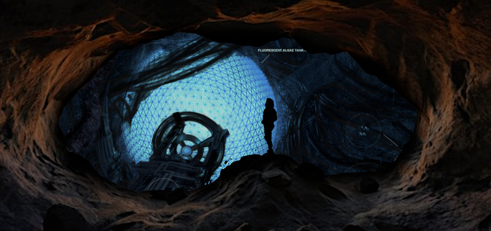

# Outtake

Hi.

Yeah, I know. Last person you wanted to see alive. If it’s any consolation, I might not be by now. Maybe I’m dead, maybe payback arrived and you just slept through it.

Doesn’t matter. Put your hatred aside for a moment. You want to hear this.

We’ve picked up a—a hitchhiker. Says it’s Human, says it’s what we turned into a few million years after we shipped out, but there’s no fucking way. I _saw_ it—pieces of it, anyway— over on _Araneus_. (Oh right, we ran into _Araneus_ the other day. What’s left of her, anyway. What are the odds?) The recorder data’s severely degraded—which is suspicious in its own right, she’s been derelict for less than two million years as far as we can tell— but it shows something coming out of the last gate she built, something that reached for _Araneus_ like a falling man grasping at a branch. It shows something else too, coming out behind it, stretching and snapping back like a rubber band stretched too far.

We tried to leave the fucking thing behind, but it followed us home. Rode the shuttle bareback. Chimp won’t let us hurt it. Chimp thinks it’s just another member of the crew— maybe even the _most_ important because it’s more—I dunno, _recent_. It melted before we even got out of the shuttle: all those joints, all those limbs and slits, all those _eyes_. Encysted into some kind of chrysalis. It’s down in Med5 right now, turning into—

Well, we don’t know yet.

But I’m pretty sure it won’t be emerging as a butterfly. I think, once metamorphosis is complete, our degrees of freedom go to zero. I mean, it’s still just a puddle of organic soup and it’s already got Chimp in its pocket. When it hatches, who knows? Maybe we’ll be lemurs and it’ll be God and there’s nothing we’ll be able to plan or say or even goddamn _think_ that it won’t know before we do.

So I’m bringing you back now, while there’s still some ghost of a chance that no one else knows what I’m doing. I’m using back doors and secret tunnels from the old days. I’m using Lian’s bypasses so Chimp won’t know you’ve been moved.

I know what you’re thinking. I did what I did. I’d do it again. But it was a broad-strokes deal, it’s not like I told Chimp about every stitch and seam in the revolution. There’s a lot he doesn’t know. He doesn’t know we can do this, for one thing. He doesn’t know you’re down here in the Black Forest and not snoozing away in C4B. So long as he doesn’t start missing his favorite pet enough to try bringing you back for old times’ sake, we should be okay. And yes, that’s a risk—but you two didn’t part on the best of terms. I’m betting—I’m hoping Chimp doesn’t need the grief.

So now you’re wondering _why take that chance? Why_ me_, out of all these thousands?_ But I don’t know how many thousands there are any more. Every thinking being within ten thousand lightyears is right here, buried in this fucking rock, and after sixty-seven million years I’ve still only met a fraction of them. I trust barely a fraction of those. Most of them would probably be just as happy to see me tossed out an airlock. You’d be first in line.

But that’s the point. I know you. I know the purity of your hatred. It burns pretense to ash. You’re the last person I’d ever trust with my life, but this isn’t about my life. It’s about everyone else’s. It’s about _Eriophora_. You’ll pick up this baton for the exact same reason you’d kill me if you got half a chance.

So I’m sorry, but you’re drafted: someone behind the scenes, someone Chimp thinks is safely out of play, someone this abomination, this _parasite_ doesn’t know about. And I pray to whatever Gods may prevail over that one that, when it hatches, it won’t be able to read my mind back to this moment and see what I’m doing now, because if it can then all hope is truly lost.

I’m not saying it’s a foolproof plan, or even a good one. It’s probably a terrible plan. But it’s the best I can come up with on short notice. And I’m already beyond forgiveness; I’ve got nothing to lose by conscripting you. So wake up, wild card. Wake up, hidden variable. Watch from the shadows. Fight back against a god that hopefully doesn’t know you exist. Be the blind spot in omniscience.

Gods help us, Sunday, I think we’ve got a gremlin on board.

This entry was posted on Thursday, January 23rd, 2025 at 10:14 am and is filed under [fiblet](https://www.rifters.com/crawl/?cat=27), [Sunflowers](https://www.rifters.com/crawl/?cat=57). You can follow any responses to this entry through the [RSS 2.0](https://www.rifters.com/crawl/?feed=rss2&p=11409) feed. Both comments and pings are currently closed.