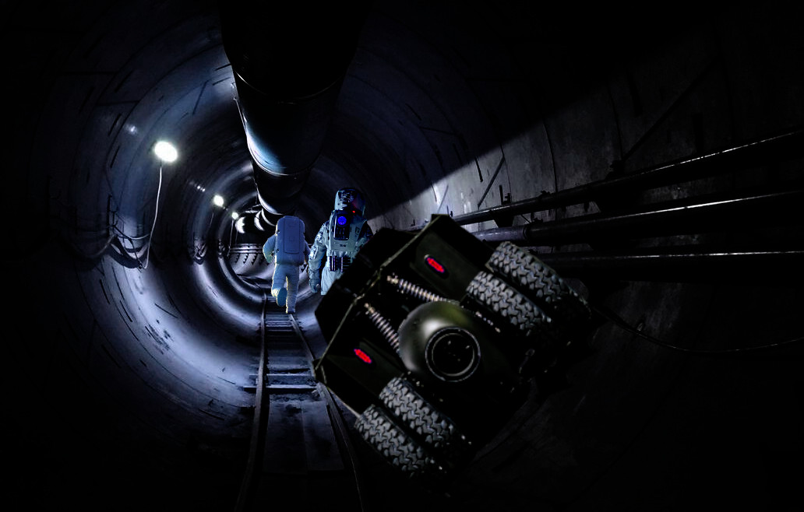

# Remora

Just below the surface, now. The stars so close he can almost see them.

The prep compartment is equal parts hope and terror: just a few more meters to the shuttle, Heinwald can see the docking hatch right there in front of him. But isn’t this always where the monster jumps out? Isn’t it during that last dash, escape and freedom close enough to touch, when one of those empty spacesuits turns in its alcove to reveal the thing hiding inside, biding its time behind the smashed faceplate? Isn’t it _now_, just when you think you’re safe, that you learn it was waiting for you all along?

Solway and Vrooman are always fucking ahead of him. Heinwald suppresses the urge to barge forward, to push them aside and dive for the hatch in a final frantic burst of speed. He keeps his escape velocity in check, observes a quick but orderly departure while his heart hammers fast enough to jump out of his chest and run the four-hundred all by itself.

Sol’s back in the shuttle, Vrooman’s in the tube. Heinwald is all alone in _Araneus_.

No. Not _all_ alone…

Finally, the way is clear. Heinwald keeps his eyes straight ahead and steps forward. Nothing grabs him from behind.

He made it. He’s in the shuttle. Oh dear God he’s _going home…_

Vrooman slaps a control. The hatch seals tight. Air rushes into the compartment, its hissing crescendo muted by Heinwald’s helmet. They strap in.

Solway’s on comms. “Chimp, get us out of here.”

Static and pops.

“_Chimp._“

Vrooman’s working the docking clamps. It’s taking too long. Cabin pressure’s a steady 92 kPa, but nobody’s taking off their helmets.

Solway tries again: “_Eri_, do you read?”

“Fucking clamps won’t release,” Vrooman hisses.

“_Eri_ here.” Chimp’s voice crackles through the interference. “Standing by to extract.”

“Extract, then! Now!”

“I’ll lift you off as soon as everyone’s on board,” Chimp responds.

“We _are_, Chimp. Take us home.”

“I’m reading one person still offsite.” The AI sounds almost apologetic.

They exchange looks. “Maybe the interference is fucking with his telemetry,” Heinwald suggests.

“Roll call,” Vrooman says. “Vrooman.”

“Solway,” Sol calls out.

“Heinwald.”

“All present and accounted for, Chimp. Now _get us the fuck out of here._“

“Just as soon as everyone’s on board.”

“Holy fucking Christ,” Vrooman mutters.

Solway unbuckles from her mesh. “Manual those clamps.”

“What do you think I’ve been doing?”

“It’s a fucking _lever_, Ari. What could go wrong?”

Heinwald calls the shuttle controls to his HUD. The moment those clamps unlock they’ll be floating free next to a rolling mountain with a black hole wobbling around in its belly, and if Chimp won’t be running the show—

_Thump_.

Everybody freezes. Slowly, in sync, they turn to face the hatch.

“That was _outside_…” Solway whispers.

_…tickettatickettaticketta…_

The clamps disengage. “Extraction proceeding,” Chimp reports cheerfully. “ETA _Eriophora_ one point one seven kilosecs.”

Thruster icons bloom red on Heinwald’s HUD. The shuttle lurches and yaws; _Araneus_ rolls away to port, a great basalt fist receding into the void. The stars wheel: all but one, larger but somehow dimmer than the others, holding position against that rotating backdrop. It swells in gentle, almost indiscernible increments.

Outside, something clicks against the hatch, scrabbles gently across the hull, and settles in for the trip.

This entry was posted on Friday, July 1st, 2022 at 9:33 am and is filed under [fiblet](https://www.rifters.com/crawl/?cat=27). You can follow any responses to this entry through the [RSS 2.0](https://www.rifters.com/crawl/?feed=rss2&p=10284) feed. Both comments and pings are currently closed.