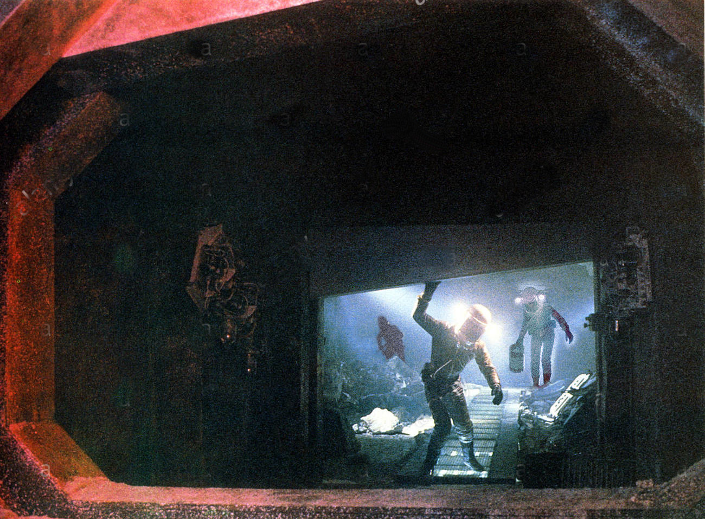

# Strategic Retreat

Solway’s holding the torch when Heinwald emerges into the corridor. She points it at the breach like a flamethrower. Heinwald ducks out of the way as the three tracks of breathing filling his helmet drop to two, to one; the others have killed their radios.

Heinwald does the same, joins his fellows, leans in until all helmets are touching. Solway flips the charger on her torch as the bot rejoins the group: her unsteady aim stays fixed on the opening.

“Sol.” Heinwald shakes his head, vaguely amazed he’s saying this. “It hasn’t _done_ anything.”

“Are you crazy?” Her voice is muzzy through the acrylic, a vibration almost as much felt as heard. “_Araneus_ just wrecked _itself_?”

“We don’t know anything for sure. Whatever that thing is, do we really want to piss it off?”

The breach remains empty in the combined light of their headlamps.

“So we let it come back with us?” Vrooman. “We just welcome it onto _Eri_?”

“We don’t even know if the torch can hurt it,” Heinwald points out.

“Looked like meat to me. Cookable.”

“That _meat_ survived fuck knows how many aeons in hard vacuum at absolute zero and you think a welding rig is going to take it out?”

“It’s leverage,” Solway says.

“What?”

“It has to come through here. Maybe you’re right, Vic, maybe a beam that vaporizes titanium won’t even make this thing itch. But we’re not gonna get better odds anywhere else.”

“It might not even be hostile,” Heinwald says. “If it wanted to kill us why are we still alive?”

Vrooman’s got an answer to that: “Maybe it’s not interested in a few scouts. Maybe it wants to track back to the whole nest. Who knows _what_—”

“…not…idiot” Solway’s helmet slips and slides against theirs as she hefts the torch, makes and breaks and makes contact. “…not gonna blast… first. …is. We ask _questions_…”

“It said it was hard to talk—”

“Fuck that. It gives us answers or it doesn’t pass.”

Still nothing. Where the fuck _is_ it?

“Maybe we’ve got it wrong. Maybe it doesn’t care about us, maybe it doesn’t even want to leave the cavern.”

_They never let me in…_

Thirty seconds. Sixty.

_Fuck this_. Heinwald wakes comms. “Hello? Uh…Hitchhiker?”

“…”

“You there?”

A hiss. A carrier wave. The cackle of some distant sparking short-circuit.

“It’s there all right,” Solway buzzes. “It wouldn’t go to the trouble of—of _waking up_ and tracking us down and _introducing itself_ for fucksake and then just go away_.”_

“It _knows_,” Vrooman says.

She keeps her torch trained on the opening. “That’s good, right? Doesn’t want to come through, maybe it thinks we can hurt it.”

Heinwald breaks contact and steps over to the cart. The cascade’s down by almost half.

He leans back in. “We can’t stay here.”

“This is the only bottleneck we got,” Solway reminds them.

“And we barely have enough O2 to make it back as it is. We’re gonna wait out something that holds its breath for millions of years at a stretch?”

“Maybe we could go back inside,” Vrooman says, “and _Parlez_.” His voice sounds dangerously close to a giggle.

“Maybe seal it in somehow,” Solway suggests.

Heinwald looks around the corridor for loose plating, or convenient boulders loosed from some fissure they didn’t notice on the way in. “Maybe we can…” _go back inside with that thing and somehow pull back the slab we cut out and weld it shut…_

“What?” Solway says.

“Nothing. Never mind.”

And all the while the sheer adrenaline boost of fight/flight is sucking oxygen out of their tanks as though they were running a marathon. Heinwald’s got maybe ten minutes before he has to tap the cascade again and when they all do that they’ll be down to 45% easy, without having even started back up and that fucking horrific self-described _human_ is lurking back there in the dark with all those porcelain bones, got all the time in this world and a dozen others…

Solway seems to accept it at last. She breaks contact, steps away; behind her faceplate Heinwald sees her throw her head back and open her mouth in a silent prolonged _FUUUUCCCCCKKKK!!!!_ that probably would have deafened the lot of them if her comms had been on.

She returns to the fold, leans in. “Hook up the electricals.”

She stands watch, the torch almost a part of her now, while they retrieve servos and spinal cords from the Faraday bags. It only takes a few minutes to snap the cart’s nervous system back into place but Heinwald’s tank is still down to the dregs by the time they finish. Everyone piles onto the cart: Vrooman back in the driver’s seat, Solway twisted around facing backward with her gloved hands still clenched tight on the torch, Heinwald plugged into the cascade to grant himself another few minutes of life. The cart spins backward, skidding; forward; back again in a tight three-point turn that bruises the rock wall; straightens and lines up back the way they came.

They boot.
